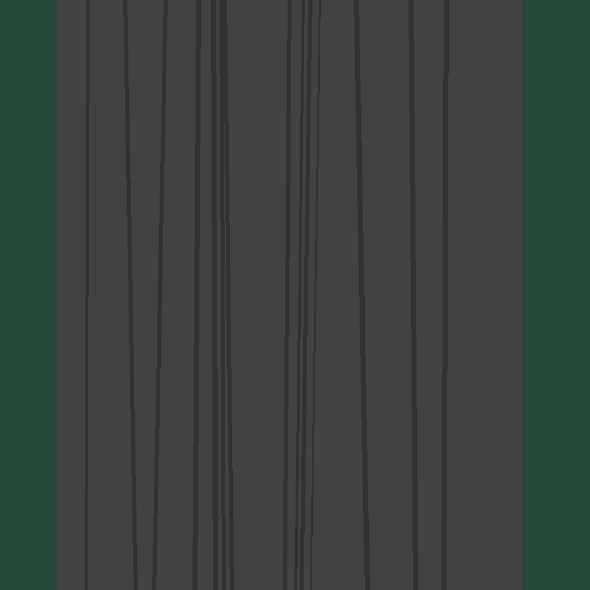
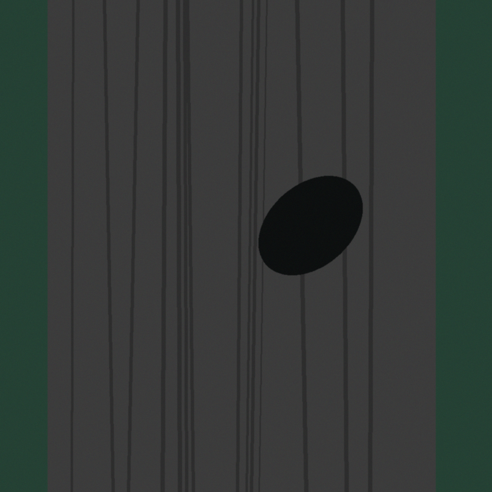
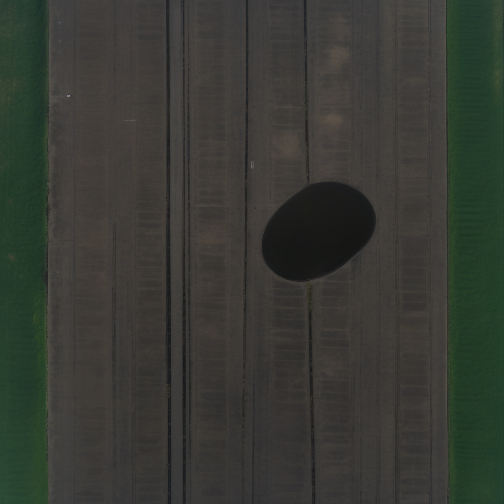
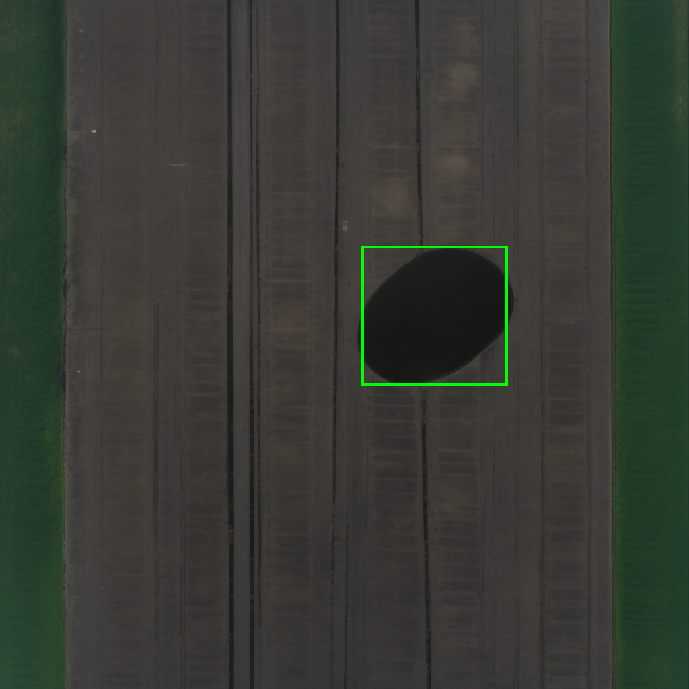
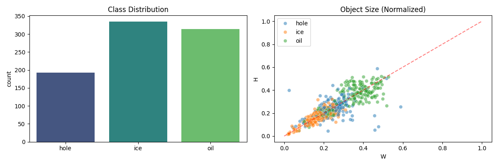
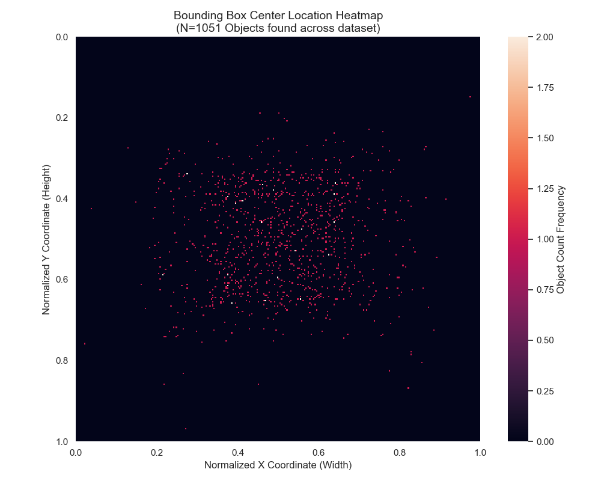
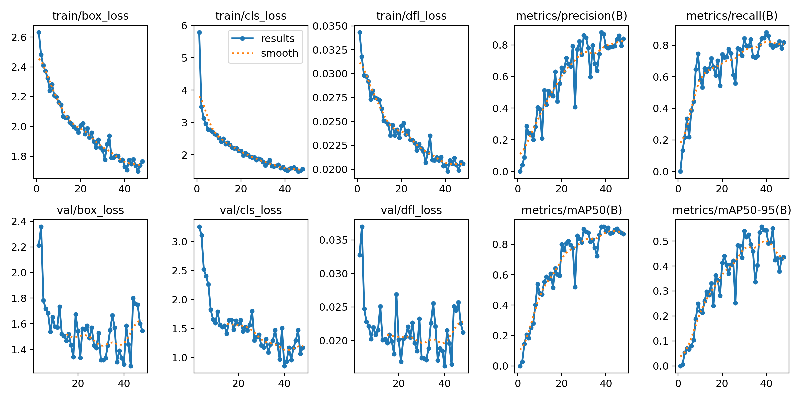
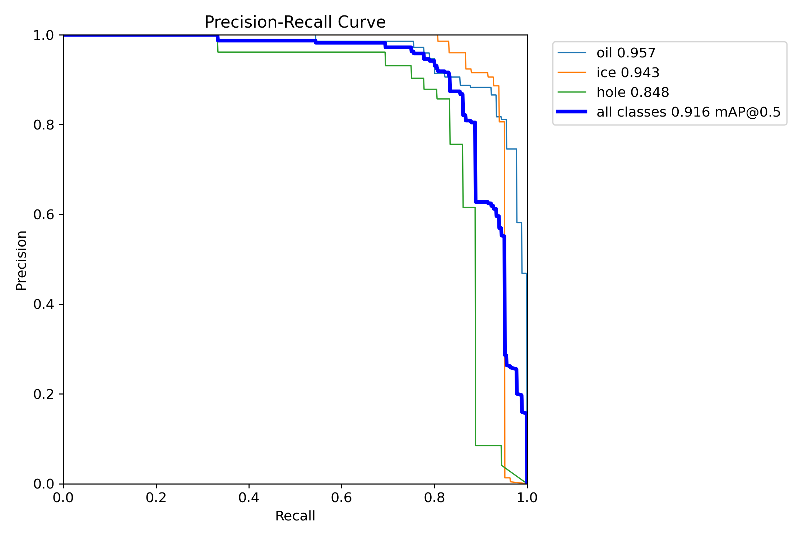
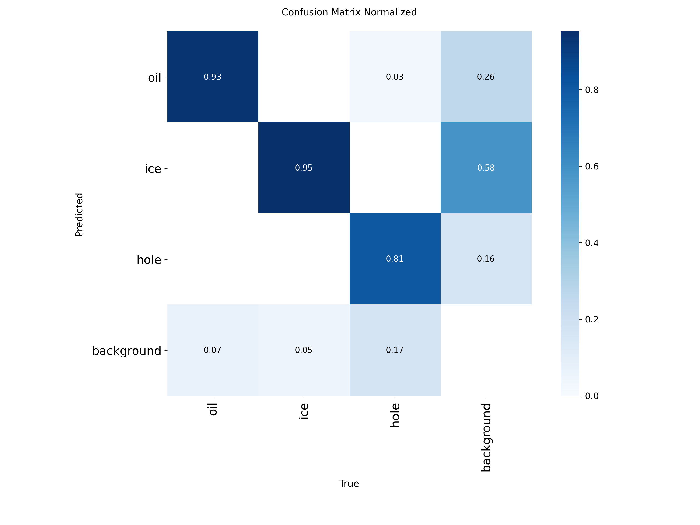

# GenAI - Runway Foreign Object Detection

**DataSet Link:**  
https://drive.google.com/drive/folders/1yT7Xh2XZuWhQT9_ujwvSrzlyq6i68UFk?usp=sharing  
To setup the dataset for training put the "dataset" folder with it's contents inside the cloned repo.  

The README is divided into sections where in each section we go into depth about each model:
* [**📷 Dataset Generation**](#dataset)
* [**📊 Exploratory Data Analysis (EDA)**](#eda)
* [**🛠️ Data Augmentations**](#augmentations)
* [**🤖 Model Selection and Training**](#training)
* [**📈 Evaluation**](#evaluation)
* [**💯 End Summary**](#summary)

## 📖 Project Overview
This project focuses on developing an automated Foreign Object Debris (FOD) detection system for airport runways using state-of-the-art Computer Vision. Detecting hazards like oil spills, ice chunks, and potholes is critical for aviation safety, but acquiring high-quality, labeled satellite or aerial imagery of these specific defects is often difficult and expensive.

To solve this, we leverage Generative AI (Stable Diffusion XL) to create a massive, high-fidelity synthetic dataset. By using a controlled "Base Layout" approach, we mathematically define the exact location of defects ensuring 100% accurate YOLO labels while the AI handles the complex task of rendering realistic textures like weathered asphalt, granular soil, and translucent ice.

**Core Objectives**
* **Synthetic Data Pipeline:** A custom-built pipeline that generates randomized runway environments, including grass/dirt shoulders, tire skid marks, and varied markings, and injects realistic anomalies.  

* **High-Resolution Detection:** Training a YOLOv26 model to identify small-scale hazards in high-resolution aerial views.

* **Safety-Critical Accuracy:** Achieving high precision and recall to ensure that even the most subtle oil puddles or ice fragments are flagged before they pose a risk to aircraft.

**Target Classes**
* **Oil Puddles:** Viscous black puddles with realistic liquid reflections and varied spill shapes.

* **Ice Chunks:** Solid, jagged blocks of frozen debris with translucent white and blue textures.

* **Potholes/Sinkholes:** Deep structural failures in the asphalt showing jagged edges and exposed granular soil or voids.

## 📷 Dataset Generation
The dataset is built using a proprietary synthetic pipeline that bridges procedural computer graphics with Stable Diffusion XL (SDXL). This hybrid approach solves the "Data Scarcity" problem in aviation safety by generating high-fidelity, diverse imagery that would be impossible or cost-prohibitive to capture in the real world. By mathematically defining the environment before the generative step, we achieve pixel-perfect label accuracy without the need for manual human annotation.

**Step 1:** Basic Layout (Procedural Environment)  
The pipeline first constructs a clean runway environment using OpenCV. It randomizes asphalt gray-tones to simulate varying levels of weathering. To prevent model over-fitting, we procedurally generate grass or dirt shoulders (5-15% image width) and inject "burnt rubber" tire skid marks that serve as texture anchors for the AI.  
  

**Step 2:** Object Injection (Geometric Proxies)  
We calculate the spatial coordinates for the anomaly and inject a high-contrast geometric proxy. For Oil Spills, we use randomized ellipses; for Ice Chunks and Potholes, we generate jagged, irregular polygons. These proxies act as a "roadmap" for the diffusion model, telling it exactly where to focus the generative detail.  
  

**Step 3:** Image Generation (AI Refinement) 
The low-fidelity layout is processed through the SDXL Img2Img pipeline. Using a controlled AI_STRENGTH (0.55 - 0.65), the AI "hallucinates" realistic textures over our proxies. It transforms the shapes into viscous liquid pools with reflections, translucent frozen blocks, or jagged asphalt collapses with granular soil textures.  
  

**Step 4:** Labeling (YOLO Mapping)  
Because the object's position was mathematically defined in Step 2, the bounding box is already known. The system automatically maps these coordinates to the final image, generating a normalized YOLO .txt file. This ensures the training labels are perfectly aligned with the visual anomalies, eliminating "label noise" entirely.  
  

## 📊 Exploratory Data Analysis (EDA)
Before training the model, an Exploratory Data Analysis (EDA) was performed on the synthesized training set to understand the data's underlying patterns. This stage is critical for ensuring that the model does not develop a bias toward specific object sizes or classes.  

**📈 Distribution Insights**  
The EDA focused on two primary metrics: Class Frequency and Spatial Scale. 
  
**Class Distribution (Left Plot):**
* The bar chart illustrates the count of objects per category: Hole, Ice, and Oil.
* **Finding:** The dataset maintains a healthy balance between classes, with a slightly higher representation of Ice and Oil to account for their higher visual variability.
* **Importance:** A balanced class distribution prevents the model from favoring the most numerous class and ensures robust performance across all hazard types.

**Object Size (Normalized) (Right Plot):**
* This scatter plot visualizes the Width (W) and Height (H) of every bounding box in the training set, normalized to the image dimensions (0.0 to 1.0).
* **Finding:** Most objects fall within the 10% to 40% size range relative to the input size.
* **Correlation:** The red dashed line represents a 1:1 aspect ratio. The data points follow this line closely, indicating that our procedural generators successfully create realistic, non-stretched anomalies.
* **Scale Variance:** The plot confirms a wide variety of scales, from "nano" debris to large structural failures. This variance is crucial for training the model to detect hazards from different flight altitudes and distances.

**🗺️ Spatial Density Analysis**  
To ensure the model learns to scan the entire runway rather than just "looking in the middle," we analyzed the center-point locations of all generated objects.

* **Spatial Distribution:** The heatmap reveals a high-variance "cloud" of object placements across the center and intermediate zones of the runway.

* **Finding:** While objects are concentrated away from the extreme grass shoulders to maintain runway relevance, there is no single "hotspot" bias.

* **Importance:** This ensures that the YOLO model learns to detect debris regardless of its lateral or vertical position on the asphalt.

**🛠️ Key EDA Conclusions**  
* **Metric Alignment:** The high correlation in aspect ratios suggests that anchor box optimization in YOLO will be straightforward and effective.
* **Dataset Integrity:** The automated pipeline successfully avoided "Label Errors" (like missing annotations or misaligned boxes), which is a common failure point in manual labeling.
* **Realism Check:** The overlap in object sizes across classes ensures the model learns the features of the hazard rather than just its size.

## 🛠️ Data Augmentations
The following augmentations are applied during training to ensure the model generalizes across diverse runway conditions, lighting environments, and flight altitudes.

| Augmentation | Explanation | Rationale | Metric |  
| :--- | :--- | :--- | :--- |
| Mosaic | Combines four training images into one at different scales.| Essential for FOD: Forces the model to recognize small debris (oil, ice) within complex, varied backgrounds. | 1.0 (Enabled) |  
| Resize | Scales input images to a fixed square dimension. | Standardizes input for the YOLO architecture while maintaining normalized coordinate accuracy. | 640 × 640 pixels |  
| Random Rotation | Rotates the image randomly within a specified range. | Simulates varying flight paths or satellite sweep angles where the runway is not perfectly vertical. | ± 15.0 Degrees |  
| Vertical/Horizontal Flip | Mirrors the image along the X or Y axis. | Satellite/Aerial views are orientation-independent; a pothole is valid from any direction. | p = 0.5 |  
| HSV Jitter | Randomly adjusts Hue, Saturation, and Value (Brightness). | Simulates different times of day (harsh midday sun vs. evening) and weathered asphalt color shifts. | H=0.015, S=0.7, V=0.4 |  
| MixUp | Overlays two images with varying transparency. | Regularizes the model by preventing over-reliance on specific pixel-perfect edges, improving generalization. | p = 0.1 |  
| Scale & Translate | Zooms and shifts the image randomly. | Simulates different camera altitudes and framing offsets from the aircraft/UAV center. | Scale=0.5, Trans=0.1 |  

## 🤖 Model Selection and Training
For this project, we selected the YOLOv26n architecture, a cutting-edge model designed for high-speed object detection without compromising on the ability to detect small-scale features. This choice is particularly effective for runway FOD (Foreign Object Debris) detection, where speed and precision are critical for safety-critical monitoring.

 

**⚙️ Training Configuration**  
The model was trained with a focus on stability and high-resolution spatial awareness. Key hyperparameters from the training script include:
* **Network Depth:** We utilized the 'nano' variant (yolo26n.pt) to maintain a lightweight footprint suitable for real-time edge deployment.
* **Target Resolution:** Images were trained at an input size of 640px (imgsz=640). While the source data is $1024 \times 1024$, 640px provides an optimal balance between VRAM efficiency and the ability to distinguish small oil puddles and ice fragments.
* **Optimization:** We employed the AdamW optimizer with a batch size of 16, utilizing Automatic Mixed Precision (AMP) to accelerate training on the GPU.
* **Early Stopping:** A patience of 10 epochs was implemented to prevent overfitting, ensuring the model generalizes well to new, unseen runway textures.

**📉 Learning Performance**
The training process successfully converged over 50 epochs, demonstrating high stability in both bounding box localization and classification accuracy.

| Metric | Performance Insight |
| :--- | :--- |
| Box Loss | Steady downward trend in both training and validation sets, indicating the model learned to tightly bound objects with high precision.
|Classification Loss | Rapid convergence, confirming that the high-contrast "proxies" used in our GenAI pipeline provided clear categorical features. |
| mAP@50 | The model reached peak accuracy quickly, maintaining a high mean Average Precision across all three classes (Oil, Ice, Hole).|

**🧪 Model Generalization**  
By incorporating a wide array of augmentations (Mosaic, MixUp, and HSV Jitter), the model was forced to look for the structural characteristics of debris rather than memorizing background textures. This results in a robust detector capable of handling varying weather conditions and runway markings without hallucinating false positives.

## 📈 Evaluation
The model was evaluated using a held-out validation set to assess its real-world performance. While the overall detection accuracy is high, a deep dive into the specific metrics reveals clear strengths and areas for future refinement.

**🎯 Overall Accuracy (mAP)**  
The Precision-Recall (PR) Curve demonstrates robust performance across all target classes.

* **Mean Average Precision (mAP@0.5):** The model achieved an impressive 0.916 across all classes.

* **Class Specifics:** Oil (0.957) and Ice (0.943) are detected with near-perfect accuracy, while Holes (0.848) represent the most challenging class due to their varied geometric shapes.

**🔍 Candid Analysis: Confusion Matrix**  
While the detection curves look promising, the Confusion Matrix reveals the specific "hallucinations" and misclassifications the model struggles with.

* The Background Issue: There is significant confusion between the Background and Ice/Oil classes.
    * Specifically, 58% of background instances are being incorrectly flagged as Ice. This is likely due to the "blue tint" issue and complex runway textures being mistaken for translucent frozen debris.

    * 26% of background instances are flagged as Oil, suggesting tire marks or dark asphalt patches are triggering false positives.

* Localization Accuracy: On a positive note, once an object is detected, it is rarely assigned the wrong class (e.g., Oil is almost never mistaken for a Hole).

**🛠️ Evaluation Summary**  
The model is exceptionally good at identifying and classifying known anomalies (mAP > 0.9), but it is currently over-sensitive to complex background textures. Future iterations will focus on adding more "Background-only" images to the training set to teach the model what a clean runway looks like, thereby reducing these false positive rates.

## 💯 End Summary
This project successfully demonstrates the power of Generative AI in overcoming data scarcity for safety-critical aviation tasks. By bridging procedural geometry with Stable Diffusion XL, we created a high-fidelity synthetic dataset that allowed a YOLOv26n model to achieve an impressive 0.916 mAP@0.5 in detecting Foreign Object Debris (FOD).

**🏆 Key Achievements**  
* **100% Label Accuracy:** By utilizing a "Mathematical Proxy" pipeline, we eliminated the human error and high costs associated with manual labeling, ensuring every training image was perfectly annotated at the moment of creation.

* **High-Speed Detection:** The selection of a YOLOv26 'nano' architecture ensures the system is capable of real-time monitoring on edge devices, a requirement for active runway safety systems.

* **Material Realism:** The model successfully learned to distinguish complex textures such as the translucency of ice and the liquid sheen of oil from standard weathered asphalt and tire skid marks.

**⚠️ Challenges & Lessons Learned**
* **Background Sensitivity:** The evaluation phase highlighted a significant challenge with "Background Noise." The model is currently prone to false positives, with 58% of background textures being mistaken for Ice. This identifies a clear need for "Negative Sample" training.

* **Geometry Variance:** While Oil and Ice were detected with near-perfect accuracy (>0.94 mAP), Potholes (0.848 mAP) proved more challenging due to their lack of a consistent "color anchor," requiring more diverse structural proxies in future iterations.

**🚀 Future Roadmap**
To move this system closer to a production-ready environment, the next development phases will focus on:

* **Background Hardening:** Implementing a "Negative Mining" strategy by adding thousands of "Hazard-Free" runway images to the training set to drastically reduce false positive rates.

* **Weather Simulation:** Expanding the Generative AI prompts to include rain, snow, and low-visibility fog conditions to ensure the detector remains robust in all climates.

* **Cross-Platform Testing:** Testing the model's inference speed on varied edge hardware (e.g., NVIDIA Jetson) to optimize for deployment on runway inspection vehicles or UAVs.